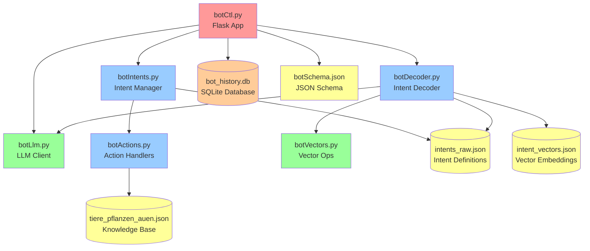
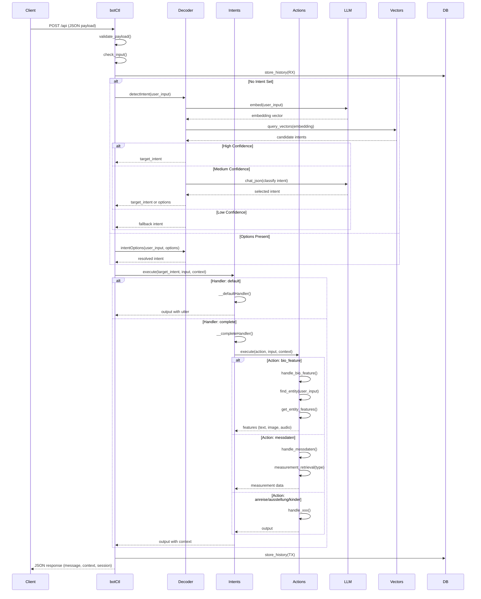
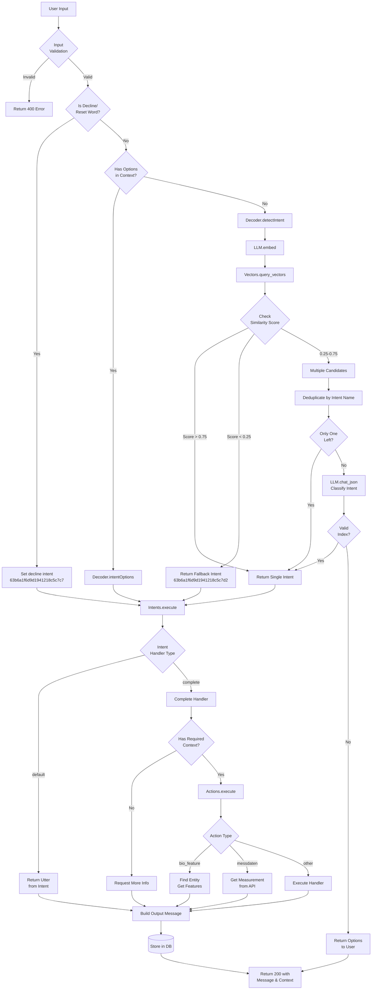

# AuenBot - Architecture and Dependency Documentation

## Overview

AuenBot is a Flask-based chatbot application designed to answer questions about animals, plants, and natural habitats in the Karlsruher Rheinauen. The application uses a conversational state machine with intent classification, vector-based similarity search, and LLM fallback mechanisms to provide intelligent responses to user queries.

## Architecture Summary

The application is built around a Flask wrapper (`botCtl.py`) that coordinates several specialized modules:

- **botCtl.py** - Main Flask application and orchestrator
- **botDecoder.py** - Intent detection and classification
- **botIntents.py** - Intent execution and handler management
- **botActions.py** - Action handlers for specific intent types
- **botLlm.py** - LLM client for OpenAI-compatible models
- **botVectors.py** - Vector operations for similarity search
- **makeDataFiles.py** - Data processing utility (standalone)

---

## Module Dependencies

### Dependency Graph



### Import Relationships

**botCtl.py imports:**
- `botIntents.BotIntent`
- `botLlm.OpenAICompatClient`
- `botDecoder.BotDecoder`
- Flask, SQLAlchemy, jsonschema (external)

**botDecoder.py imports:**
- `botLlm.OpenAICompatClient`
- `botVectors.load_vectors, query_vectors`

**botIntents.py imports:**
- `botActions.BotAction`
- rapidfuzz/fuzzywuzzy (external)

**botActions.py imports:**
- rapidfuzz/fuzzywuzzy (external)
- requests (external)

**botLlm.py imports:**
- requests (external)

**botVectors.py imports:**
- numpy (external)

**makeDataFiles.py imports:**
- pandas (external)

---

## Call Graph

### Main Request Flow



### Intent Detection Flow (Detailed)



---

## Module Descriptions

### 1. botCtl.py (Main Flask Application)

**Purpose:** Central orchestrator and Flask web application entry point.

**Key Responsibilities:**
- Exposes `/api` endpoint (GET for health check, POST for bot interactions)
- Validates incoming JSON payloads against JSON schema
- Manages conversation sessions and sequences
- Orchestrates intent detection and execution workflow
- Stores conversation history in SQLite database
- Initializes and manages global instances of BotIntent, BotDecoder, and LLM clients

**Key Functions:**
- `route_handler()` - Main POST endpoint handler
- `health_check()` - GET endpoint for health status
- `check_input(validated)` - Validates and extracts request parameters
- `validate_payload(payload)` - JSON schema validation
- `store_history()` - Persists conversation to database
- `checkOptions()` - Matches user input against available options

**Database Schema (HistoryRecord):**
- `id` - Primary key
- `received_at` - Timestamp
- `message` - Message JSON
- `message_type` - "RX" (received) or "TX" (transmitted)
- `status` - Processing status
- `llm_used` - Whether LLM was used
- `context` - Full context JSON
- `intent` - Detected intent
- `lang` - Language (de/en/fr)
- `message_text` - Text content
- `session_id` - Session identifier (indexed)
- `sequence` - Message sequence number

**Special Handling:**
- Decline/reset keywords: ["nein", "no", "non", "stop", "halt", "restart", "reset"]
- Fallback intent ID: "63b6a1f6d9d1941218c5c7d2"
- Decline intent ID: "63b6a1f6d9d1941218c5c7c7"
- Auto-starts `startModels.sh` on new session if present

---

### 2. botDecoder.py (Intent Detection Engine)

**Purpose:** Detects user intent from input text using vector similarity and LLM classification.

**Key Responsibilities:**
- Loads and manages intent definitions
- Performs vector-based similarity search for intent matching
- Uses LLM for disambiguation when confidence is medium
- Resolves user selections from options
- Manages confidence thresholds

**Key Functions:**
- `detectIntent(user_input, lang)` -> `tuple[str | list, bool]`
  - Returns single intent (high/low confidence) or options list (medium confidence)
  - Returns bool indicating if LLM was used
- `intentOptions(input_text, options)` -> `tuple[bool, str]`
  - Matches user input against provided options
  - Returns success flag and resolved intent
- `loadIntents(intent_path)` - Loads intent definitions from JSON
- `loadVectors(vectors_path)` - Loads pre-computed embeddings
- `loadModels()` - Initializes LLM client
- `__get_intent_by_id(intent_id)` - Internal lookup by ID

**Configuration:**
- Default thresholds: low=0.25, high=0.75
- Default neighbors: 5
- Requires private config for LLM credentials

**Intent Classification Logic:**
1. Embed user input
2. Query vector database for top N similar intents
3. Check best match score:
   - < 0.25: Return fallback intent
   - > 0.75: Return best match intent
   - 0.25-0.75: Deduplicate candidates and ask LLM or present options

---

### 3. botIntents.py (Intent Execution Manager)

**Purpose:** Executes intents based on their handler type and manages completion flows.

**Key Responsibilities:**
- Loads and manages intent metadata
- Routes intents to appropriate handlers
- Manages completion flows for multi-step intents
- Coordinates with BotAction for action execution
- Handles context state management

**Key Classes:**
- `BotIntent` - Main class for intent management

**Key Functions:**
- `execute(intent_name, input, context, lang)` -> `dict`
  - Routes to appropriate handler
  - Returns output and updated context
- `__defaultHandler(intent, input, context, lang)` 
  - Simple handler that returns utterance from intent definition
- `__completeHandler(intent, input, context, lang)`
  - Complex handler for multi-step intents
  - Checks for required context properties
  - Delegates to actions for data retrieval
  - Manages property completion flow
- `get_intent_by_id(id)` - Lookup intent by ID
- `get_intent_by_name(name)` - Lookup intent by name
- `setActions(action_path)` - Initialize action handler
- `setThreshold(threshold)` - Set fuzzy match threshold

**Handler Types:**
- **default**: Returns pre-defined utterance from intent
- **complete**: Multi-step handler that collects required properties and executes actions

**Completion Flow:**
1. Check if required properties (entity, feature, type) are in context
2. If missing, attempt to extract from user input
3. If still missing, present options to user
4. Once complete, execute associated action
5. Return output and updated context

---

### 4. botActions.py (Action Handlers)

**Purpose:** Implements specific actions for intent fulfillment (data retrieval, API calls, entity matching).

**Key Responsibilities:**
- Fuzzy matching of entities (animals, plants, habitats) from user input
- Retrieves entity features from knowledge base
- Fetches environmental measurement data from external API
- Handles specialized intents (anreise, ausstellung, kinder)

**Key Classes:**
- `BotAction` - Main action handler class

**Key Functions:**
- `execute(handler_name, input, context, lang)` -> `tuple[bool, dict]`
  - Routes to specific handler
  - Returns success flag and output
- `handle_bio_feature(input, context, lang)` 
  - Retrieves biological features for entities
  - Uses fuzzy matching to find entities
- `handle_messdaten(input, context, lang)`
  - Fetches air quality measurements from LUPO API
  - Evaluates against thresholds
- `handle_anreise(input, context, lang)` - Travel information
- `handle_ausstellung(input, context, lang)` - Exhibition information
- `handle_kinder(input, context, lang)` - Children's content
- `find_entity(user_input, entity_type)` - Fuzzy search for entities
- `get_entity_features(name, key)` - Extract features from entity
- `measurement_retrieval(type, debug, lang)` - Static method for API calls
- `measurement_eval(type, value, debug)` - Evaluate measurements

**Entity Types:**
- **Tier** - Animals
- **Pflanze** - Plants
- **Auen** - Habitats

**Feature Keys:**
- Erkennungsmerkmale (identification features)
- Habitat, Lebensraum
- Fortpflanzung (reproduction)
- Größe (size)
- Lebenserwartung (life expectancy)
- And many more biological properties

**Measurement Types:**
- O3 (Ozone)
- PM10, PM2.5 (Particulate matter)
- NO2 (Nitrogen dioxide)
- LQI (Air Quality Index)

**Thresholds:**
- O3: Info=180 µg/m³, Alarm=240 µg/m³
- NO2: Info=200 µg/m³, Alarm=400 µg/m³

---

### 5. botLlm.py (LLM Client)

**Purpose:** Provides a minimal OpenAI-compatible API client for chat and embedding operations.

**Key Responsibilities:**
- Chat completion with JSON output parsing
- Text embedding generation
- HTTP communication with LLM endpoints

**Key Classes:**
- `OpenAICompatClient` - Client implementation

**Key Functions:**
- `chat_json(system, user, schema_hint, temperature)` -> `dict`
  - Sends chat completion request
  - Parses JSON from response (handles markdown code blocks)
- `embed(texts)` -> `List[List[float]]`
  - Generates embeddings for text list
  - Returns list of embedding vectors

**Configuration:**
- `base_url` - Chat endpoint base URL
- `emb_url` - Embedding endpoint base URL (can differ)
- `api_key` - Authentication key
- `chat_model` - Model name for chat
- `embed_model` - Model name for embeddings (e.g., bge-m3)
- `timeout_s` - Request timeout (default: 30s)

**Endpoints:**
- POST `{base_url}/v1/chat/completions` - Chat
- POST `{emb_url}/v1/embeddings` - Embeddings

---

### 6. botVectors.py (Vector Operations)

**Purpose:** Provides vector loading and similarity search operations.

**Key Responsibilities:**
- Load and normalize embedding vectors from JSON
- Compute cosine similarity between vectors
- Find nearest neighbors to a query vector

**Key Functions:**
- `load_vectors(filename)` -> `tuple[np.ndarray, list]`
  - Loads vectors from JSON file
  - Normalizes vectors to unit length
  - Returns vector array and corresponding intent IDs
- `query_vectors(vectors, query, num_neighbors)` -> `tuple[np.ndarray, np.ndarray]`
  - Finds k-nearest neighbors using cosine similarity
  - Returns indices and similarity scores (sorted descending)
- `compute_cosine_similarity(query, doc)` -> `float`
  - Computes cosine similarity between two vectors
  - Handles normalization

**Vector File Format:**
```json
{
  "vectors": [[...], [...], ...],
  "intents": ["intent_id_1", "intent_id_2", ...]
}
```

**Notes:**
- All vectors are normalized to unit length
- Similarity scores range from -1 to 1 (higher is more similar)
- Uses NumPy for efficient computation

---

### 7. makeDataFiles.py (Data Processing Utility)

**Purpose:** Preprocesses intent and entity data files for the application.

**Key Responsibilities:**
- Converts raw intent data to compact format
- Generates entity and feature lists for matching
- Creates categorized data files for different entity types
- Derives handler and action assignments

**Input Files:**
- `../rawData/intents.json` - Full intent definitions with examples
- `../rawData/tiere_pflanzen_auen.json` - Entity knowledge base

**Output Files (in `./data/`):**
- `intents.json` - Full processed intents
- `intents_raw.json` - Compact intents (without text examples)
- `intents_text.json` - Intent texts only
- `actions.json` - List of unique actions
- `entity_tiere.json` - Animal names
- `entity_pflanzen.json` - Plant names
- `entity_aue.json` - Habitat names
- `entity_tp.json` - Combined animal and plant names
- `feature_tiere.json` - Animal features
- `feature_pflanzen.json` - Plant features
- `feature_aue.json` - Habitat features
- `feature_tp.json` - Combined features
- `feature_kinder.json` - Children's content features
- `klasse_tiere.json` - Animal classes
- `unterklasse_tiere.json` - Animal subclasses
- `klasse_pflanzen.json` - Plant classes
- `unterklasse_pflanzen.json` - Plant subclasses

**Intent Processing Rules:**
- `tp_*` intents -> handler="complete", action="bio_feature", requires="entity,feature"
- `tiere_*` intents -> handler="complete", action="bio_feature", requires="entity,feature"
- `pflanzen_*` intents -> handler="complete", action="bio_feature", requires="entity,feature"
- `aue_*` intents -> action="bio_feature", requires="entity"
- `messdaten` -> handler="complete", action="messdaten", requires="type", options="messdaten"
- `anreise` -> handler="complete", action="anreise", requires="type", options="anreise"
- `expertise` -> handler="complete", requires="target", options="expertise"

**Note:** This is a standalone utility script that should be run when updating data files.

---

## Key Data Structures

### Context Schema
The context maintains conversation state across requests:
```json
{
  "intent": "string - current intent name",
  "entity": "string - identified entity (animal/plant/habitat)",
  "feature": "string - requested feature (habitat, size, etc.)",
  "type": "string - entity type (Tier/Pflanze/Auen)",
  "options": [
    {
      "title": "string - intent name",
      "text": "string - display text"
    }
  ],
  "last_input": "string - previous user input",
  "last_intent": "string - previous intent"
}
```

### Intent Definition
```json
{
  "id": "string - unique identifier",
  "intent": "string - intent name (lowercase)",
  "text": "array - example texts for training",
  "utter": "string - default response text",
  "utter_de/en/fr": "string - localized responses",
  "alias_de/en/fr": "string - LLM-friendly descriptions",
  "handler": "string - default|complete",
  "action": "string - action handler name",
  "requires": "string - comma-separated required properties",
  "provides": "object - properties this intent provides",
  "options": "string - option set name",
  "link": {
    "title": "string",
    "url": "string"
  }
}
```

### Entity Definition
```json
{
  "Typ": "Tier|Pflanze|Auen",
  "Name": "string - primary name",
  "Name_sci": "string - scientific name",
  "Name_alt": "string - alternative name",
  "Erkennungsmerkmale": "string - identification features",
  "Habitat": "string - habitat description",
  "Lebensraum": "string - living space",
  "Größe": "string - size",
  "Familie": "string - family",
  "Klasse": "string - class",
  "Links": [
    {
      "img": "string - image URL",
      "audio": "string - audio URL"
    }
  ]
}
```

---

## Execution Flow Examples

### Example 1: Simple Greeting Intent

```
User Input: "Hallo"
↓
botCtl receives request
↓
Decoder.detectIntent("Hallo")
↓
Vector search finds "begrüßung" intent (high confidence)
↓
Intents.execute("begrüßung") 
↓
Default handler returns utterance from intent
↓
Response: "Hi, ich bin KarlA, deine Chatbot-Rangerin😊!..."
```

### Example 2: Entity Feature Query

```
User Input: "Wo lebt der Frosch?"
↓
botCtl receives request
↓
Decoder.detectIntent("Wo lebt der Frosch?")
↓
Vector search finds "tp_habitat" intent (medium confidence)
↓
LLM classifies to confirm intent
↓
Intents.execute("tp_habitat", context={feature: "habitat"})
↓
Complete handler checks: feature=set, entity=missing
↓
Actions.find_entity("Frosch", type="Tier")
↓
Fuzzy match finds "Grasfrosch", "Wasserfrosch", etc.
↓
Actions.get_entity_features("Grasfrosch", "Habitat")
↓
Returns: {text: ["Lebt in feuchten Wiesen..."], image: [...]}
↓
Response with habitat information and image
```

### Example 3: Measurement Query with Options

```
User Input: "Wie ist die Luftqualität?"
↓
Decoder detects "messdaten" intent
↓
Intents.execute("messdaten", context={requires: "type"})
↓
Complete handler: type is missing
↓
Loads options from "options_messdaten.json"
↓
Returns: {text: "Welchen Messwert möchtest du wissen?", 
         options: ["O3", "PM10", "PM2,5", "NO2", "LQI"]}
↓
User Input: "PM10"
↓
Decoder.intentOptions("PM10", options)
↓
Matches option, returns resolved intent
↓
Actions.handle_messdaten(input="PM10")
↓
Calls LUPO API: lupo-cloud.de/air/metric/kit.iai.test.pm10
↓
Evaluates measurement against thresholds
↓
Returns: {text: "Der Feinstaubwert PM10 beträgt aktuell 25 µg/m³. 
         Der Wert liegt unter der Informationsschwelle..."}
```

---

## Configuration Requirements

### Private Configuration (private.py)
```python
apiKey = "your-api-key"
baseUrl = "https://your-llm-endpoint"
embUrl = "https://your-embedding-endpoint"  # Optional, defaults to baseUrl
embMdl = "bge-m3"  # Embedding model
lngMdl = "your-chat-model"  # Chat model
```

### Environment
- Python 3.8+
- Flask
- SQLAlchemy
- jsonschema
- numpy
- requests
- pandas (for makeDataFiles.py only)
- rapidfuzz or fuzzywuzzy

### Data Files
- `botCtl/data/intents_raw.json` - Processed intent definitions
- `rawData/tiere_pflanzen_auen.json` - Entity knowledge base
- `rawData/intent_vectors.json` - Pre-computed embeddings (requires Git LFS)
- `botCtl/botSchema.json` - JSON schema for request validation
- `botCtl/data/options_*.json` - Option files for specific intents

---

## API Endpoints

### POST /api
Request conversation interaction with the bot.

**Request Body:**
```json
{
  "message": {
    "text": "string - user input"
  },
  "context": {
    // Optional context from previous interaction
  },
  "session": "string - session ID (auto-generated if omitted)",
  "sequence": "number - message sequence",
  "lang": "string - de|en|fr (default: de)"
}
```

**Response (200):**
```json
{
  "message": {
    "text": "string - bot response",
    "image": "string - optional image URL",
    "audio": "string - optional audio URL",
    "link": {
      "title": "string",
      "url": "string"
    }
  },
  "context": {
    // Updated context
  },
  "session": "string - session ID",
  "sequence": "number - next sequence number"
}
```

### GET /api
Health check endpoint.

**Response (200):**
```json
{
  "status": "ok"
}
```

---

## Database Schema

### Table: history

| Column | Type | Description |
|--------|------|-------------|
| id | INTEGER | Primary key (auto-increment) |
| received_at | DATETIME | Timestamp (UTC) |
| message | TEXT | Full message JSON |
| message_type | STRING | "RX" or "TX" |
| status | STRING | Processing status |
| llm_used | BOOLEAN | Whether LLM was invoked |
| context | TEXT | Full context JSON |
| intent | STRING | Detected/executed intent |
| lang | STRING | Language code |
| message_text | TEXT | Message text content |
| session_id | STRING | Session identifier (indexed) |
| sequence | INTEGER | Message sequence number |

---

## Extension Points

### Adding New Handlers
1. Add handler method to `BotIntent` class (e.g., `__myHandler`)
2. Register in `self.handlers` dict
3. Update intent definitions to use new handler type
4. Implement handler logic following existing patterns

### Adding New Actions
1. Add action method to `BotAction` class (e.g., `handle_myaction`)
2. Register in `execute()` method's handler_map
3. Update intent definitions with `"action": "myaction"`
4. Implement action logic and return output dict

### Adding New Intent Types
1. Add intent to `rawData/intents.json` with examples
2. Run `makeDataFiles.py` to process
3. Regenerate vectors: embed all examples and update `intent_vectors.json`
4. Configure handler, action, and requirements as needed
5. Add options file if using completion handler

---

## Performance Considerations

1. **Vector Search**: Currently uses brute-force cosine similarity across ~10,000 vectors. For larger datasets, consider:
   - Approximate nearest neighbor search (FAISS, Annoy)
   - Vector database (Pinecone, Weaviate, Milvus)
   - Dimensionality reduction

2. **LLM Calls**: 
   - Used only for medium-confidence cases and intent classification
   - Consider caching frequent queries
   - Monitor timeout and error handling

3. **Fuzzy Matching**:
   - Uses rapidfuzz (or fuzzywuzzy fallback)
   - Threshold set to 75 by default
   - Can be tuned per use case

4. **Database**:
   - SQLite suitable for development and moderate traffic
   - Consider PostgreSQL/MySQL for production
   - Session ID indexed for fast lookups

---

## Testing Utilities

### vectors_test.py
Located in `botCtl/vectors_test.py`, this file likely contains tests for vector operations (not analyzed in detail).

---

## Summary

AuenBot implements a sophisticated conversational AI system with:

- **Modular architecture** separating concerns (detection, execution, actions)
- **Hybrid approach** combining vector similarity, fuzzy matching, and LLM fallback
- **Stateful conversations** with context management and multi-step flows
- **External integrations** for LLM services and environmental data APIs
- **Comprehensive logging** of all interactions for analysis and debugging
- **Flexible intent system** supporting simple responses and complex data retrieval

The architecture is designed for maintainability and extensibility, with clear separation of responsibilities and well-defined interfaces between components.
